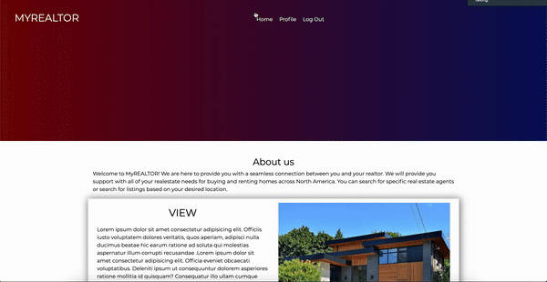

# Project-2

MYREALTOR is a webbased application used to connect real estate agents and buyers/renters.
Real estate agents can create an account and display all of their listings. 
Users can search for agents or listings based on filter criteria. 

## Installation
You must have node js installed. Once that is installed, initialize npm (npm init). 
Install @sendgrid/mail, express, body-parser, ./db/orm
Install Robo3T 

## Usage
Once installations are complete... run the file using node (node server.js)
and open local host.

## Group Members
* [Koustub Manchiraju](https://github.com/koustub)
* [Jason Kitamura](https://github.com/Jason-Kitamura)

